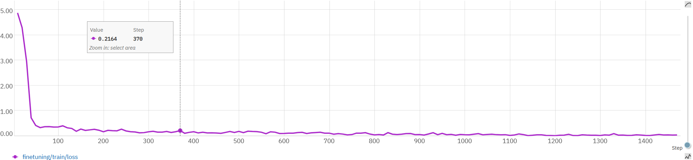
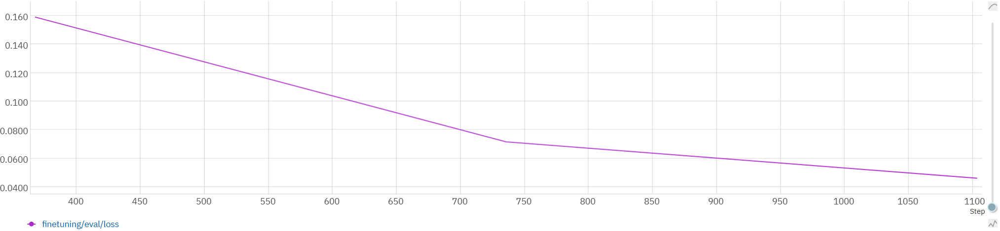

# SensorQueryWithLLM
This project discovers how LLMs can be fine-tuned to perform different downstream tasks involving various sensor modalities

# Step 0 (Pre-requisite):
1. Install torch 2.5.1 and nvidia cuda toolkits 12.4 (12.1 or 11 also works). Also make sure you have microsoft visual studio 2022 installed with "Desktop Development with C++" selected. This will make sure the MSVC and windows 11 SDK are installed.
2. Install python packages: transformers, trl, neptune(if want to track progress with neptune.ai)
3. Download the dataset: UCI HAR (https://archive.ics.uci.edu/dataset/240/human+activity+recognition+using+smartphones)

# Step 0.5 (Feature Selection):
The UCI Human Activity Recognition dataset has total 561 features for each activity instance (different metrics calculated on a 2.3 second window). This can be very large to send through an LLM query. We can select possible best N=64 features, by computing the evaluation accuracy on randomly selected N numner of features using a simple MLP network. The "FeatureSelection" folder contains code for this purpose. The script to evaluate the performance of the features is: "train.py". And after that, we can use the "read_log.py" script to extract the name of the selcted N features.

# Step 1 (Basic Query):
As a starting point, we can tell the LLM a short description of the task and the feature list, which can be provided to the role "system". Then for every recognition instance, we can simply send a list of N feature values and ask the LLM to predict the human activity.
The fine-tuning script is: "BasicQuery/finetune.py" and the evaluation script is "BasicQuery/evaluate.py". Change the necessary tokens and variables inside the script. The provided script here get a 79% accuracy on the test set.
The trend of training loss value:

The trend of evaluation loss value:

